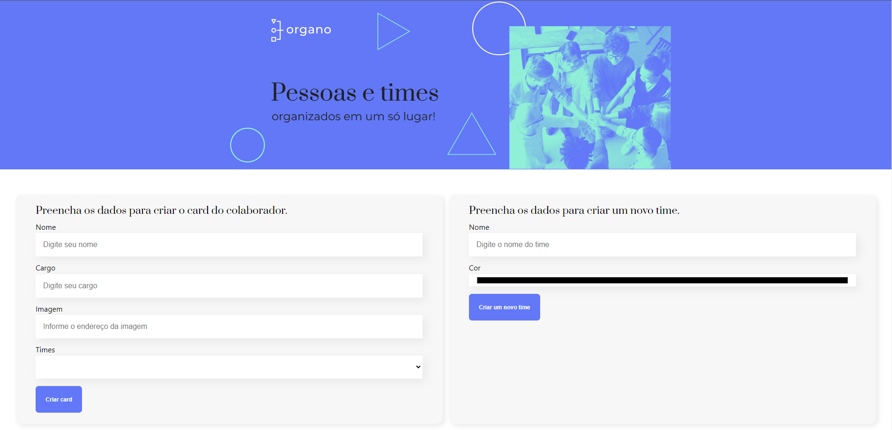

# Projeto OrganoV3

Projeto desenvolvido durante o curso de React: Como os componentes funcionam

# Principais tecnologias utilizadas no projeto
* React
* NodeJs
* Bibliotecas
 - hex-to-rgba
 - UUID
 - React icons

 # Imagens do projeto

Pagina inicial do projeto

Parte que contém os participantes da organização
